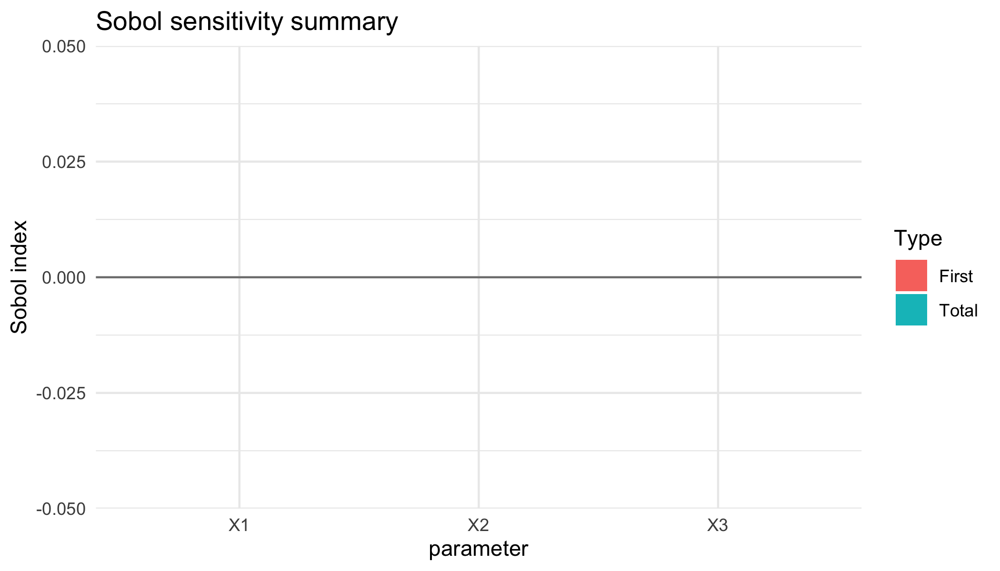
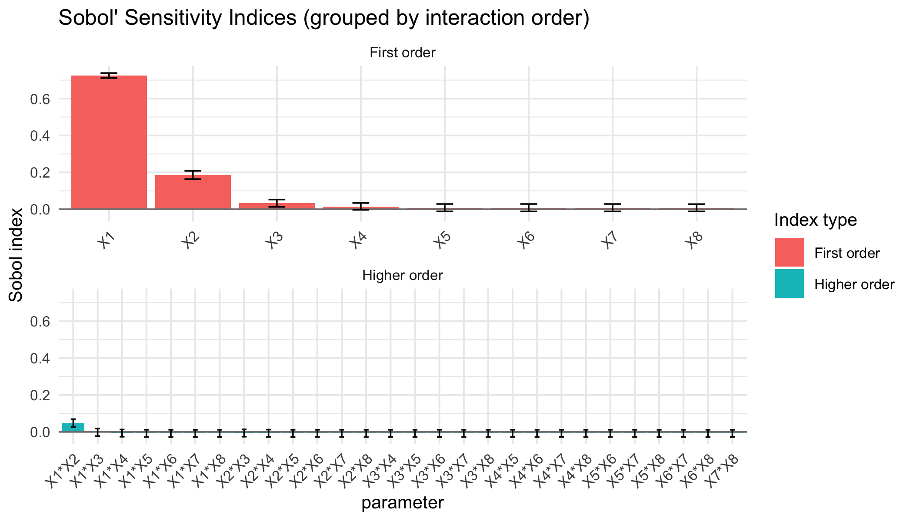

<!-- README.md is generated from README.Rmd. Please edit that file -->


# Sobol4R, Sobol Indices for Models with Fixed and Stochastic Parameters 

## Frédéric Bertrand, Elizaveta Logosha and Myriam Maumy-Bertrand

<!-- badges: start -->
[](https://github.com/fbertran/Sobol4R/actions/workflows/R-CMD-check.yaml)
[](https://github.com/fbertran/Sobol4R/actions/workflows/rhub.yaml)
<!-- badges: end -->

Tools to design experiments, compute Sobol sensitivity indices,
    and summarise stochastic responses inspired by the strategy described by
    Zhu et Sudret (2021) <https://doi.org/10.1016/j.ress.2021.107815>. Includes helpers
    to optimise toy models implemented in C++, visualise indices with
    uncertainty quantification, and derive reliability-oriented sensitivity
    measures based on failure probabilities.
    It is further detailed in Logosha, Maumy and Bertrand (2022) 
    <https://doi.org/10.1063/5.0246026> and (2023) <https://doi.org/10.1063/5.0246024> or in Bertrand, 
    Logosha and Maumy (2024) <https://hal.science/hal-05371803>, 
    <https://hal.science/hal-05371795> and <https://hal.science/hal-05371798>.
    
This site was created by F. Bertrand and the examples reproduced on it were created by F. Bertrand, E. Logosha and M. Maumy.

## Installation

You can install the latest version of the Sobol4R package from [github](https://github.com) with:


``` r
devtools::install_github("fbertran/Sobol4R")
```

## Two complementary analysis paths

Sobol4R exposes two ways to compute sensitivity indices depending on your
workflow:

* **Reuse the `sensitivity` package estimators.** Provide pre-built designs and
  call `sensitivity::sobol()` or `sensitivity::sobol2007()`; the `autoplot()`
  methods in Sobol4R will visualise those results without changing your
  existing code.
* **Use the in-package Saltelli re-implementation.** The `sobol_design()` and
  `sobol_indices()` helpers build the matrices, run the model, and return
  a `sobol_result` object that can be summarised or plotted directly, with
  optional bootstrap quantiles for noisy simulations.

The README examples below demonstrate the second path, while the earlier
"Context and non random case" section illustrates interoperability with
`sensitivity`.

## Motivation

The methodology implemented in **Sobol4R** builds upon the stochastic Sobol
analysis described by Lebrun et al. (2021) in *Reliability Engineering &
System Safety*. The paper proposes to combine replicated simulator
runs with Sobol estimators to account for intrinsic noise. The package mirrors
this workflow:

1. Generate two Monte Carlo designs (A and B matrices).
2. Evaluate the stochastic simulator several times to estimate the mean
   response and the noise variance.
3. Derive first-order and total-order Sobol indices and visualise the results.

The package is also friendly with the `sensitivity` package and shows how to use the Sobol' indices estimators provided in this package to increase the capabilities of this `Sobol4R` package.

## Basic usage


``` r
library(Sobol4R)
set.seed(123)
design <- sobol_design(n = 256, d = 3, lower = rep(-pi, 3), upper = rep(pi, 3),
                       quasi = TRUE)
result <- sobol_indices(ishigami_model, design, replicates = 4,
                        keep_samples = TRUE)
result$data
#>   parameter first_order total_order
#> 1        X1           0           0
#> 2        X2           0           0
#> 3        X3           0           0
```

The resulting object stores the Monte Carlo variance estimate, the average
noise variance across replications, and the Sobol indices. Diagnostic plots are
available through the provided `autoplot()` method:


``` r
autoplot(result)
```

<div class="figure">

<p class="caption">plot of chunk unnamed-chunk-3</p>
</div>

When `keep_samples = TRUE`, bootstrap resamples quantify the estimator
uncertainty. The helper `summarise_sobol()` produces tidy quantiles that can be
visualised directly:


``` r
autoplot(result, show_uncertainty = TRUE, probs = c(0.1, 0.9), bootstrap = 100)
```

<div class="figure">

<p class="caption">plot of chunk unnamed-chunk-4</p>
</div>

## Reliability metrics

The paper highlights the need to quantify failure probabilities associated with
critical performance levels. The package exposes a helper for that task:


``` r
set.seed(321)
simulated <- ishigami_model(matrix(runif(3000, -pi, pi), ncol = 3))
estimate_failure_probability(simulated, threshold = -1)
#> $probability
#> [1] 0.087
#> 
#> $variance
#> [1] 7.9431e-05
```

When the simulator is stochastic and `sobol_indices()` stores the replicated
samples (`keep_samples = TRUE`), the same Monte Carlo budget can be recycled to
derive failure-indicator Sobol indices:


``` r
failure <- sobol_reliability(result, threshold = -1)
failure$failure_probability
#> [1] 0.08984375
autoplot(failure, show_uncertainty = TRUE, probs = c(0.1, 0.9), bootstrap = 200)
```

<div class="figure">

<p class="caption">plot of chunk unnamed-chunk-6</p>
</div>

## Combined usage with the `sensitivity` package

### Test case : the non-monotonic Sobol g-function

The method of Sobol requires two samples. In this reference case there are eight variables, all following the uniform distribution on $[0,1]$.


``` r
if(require(sensitivity)){
n <- 50000
p <- 8
X1_1 <- data.frame(matrix(runif(p * n), nrow = n))
X2_1 <- data.frame(matrix(runif(p * n), nrow = n))
}
```


``` r
if(require(sensitivity)){
set.seed(4669)
gensol1 <- sobol4r_design(
  X1    = X1_1,
  X2    = X2_1,
  order = 2,
  nboot = 100
)

Y1 <- sobol_g_function(gensol1$X)
x1 <- sensitivity::tell(gensol1, Y1)
print(x1)
}
#> 
#> Call:
#> sensitivity::sobol(model = NULL, X1 = X1, X2 = X2, order = order,     nboot = nboot)
#> 
#> Model runs: 1850000 
#> 
#> Sobol indices
#>           original          bias  std. error
#> X1     0.714928599  0.0009558823 0.007223975
#> X2     0.183724278  0.0000624804 0.009787327
#> X3     0.027855443  0.0006997475 0.010403387
#> X4     0.010766859  0.0007602978 0.010419788
#> X5     0.004620120  0.0007537761 0.010448579
#> X6     0.004649758  0.0007462895 0.010452522
#> X7     0.004463461  0.0007438964 0.010427359
#> X8     0.004634047  0.0007602140 0.010421292
#> X1*X2  0.056723859 -0.0009475371 0.012211589
#> X1*X3  0.003935454 -0.0006296449 0.010796787
#> X1*X4 -0.002604387 -0.0007142755 0.010358372
#> X1*X5 -0.004544991 -0.0007418694 0.010437612
#> X1*X6 -0.004218935 -0.0007431264 0.010454798
#> X1*X7 -0.004514664 -0.0007320925 0.010439434
#> X1*X8 -0.004357070 -0.0007382679 0.010453573
#> X2*X3 -0.002000125 -0.0008414918 0.010476064
#> X2*X4 -0.004065270 -0.0007988678 0.010429953
#> X2*X5 -0.004516614 -0.0007620223 0.010449446
#> X2*X6 -0.004445576 -0.0007455077 0.010441943
#> X2*X7 -0.004463936 -0.0007408606 0.010444429
#> X2*X8 -0.004494686 -0.0007426589 0.010451796
#> X3*X4 -0.004482017 -0.0007738016 0.010445882
#> X3*X5 -0.004457124 -0.0007444663 0.010449294
#> X3*X6 -0.004480155 -0.0007438360 0.010445407
#> X3*X7 -0.004475348 -0.0007449987 0.010449367
#> X3*X8 -0.004435086 -0.0007448195 0.010447190
#> X4*X5 -0.004475161 -0.0007420839 0.010447688
#> X4*X6 -0.004469522 -0.0007452488 0.010447754
#> X4*X7 -0.004449099 -0.0007431436 0.010447623
#> X4*X8 -0.004464412 -0.0007423014 0.010445970
#> X5*X6 -0.004471409 -0.0007438270 0.010447393
#> X5*X7 -0.004471249 -0.0007439088 0.010447228
#> X5*X8 -0.004470571 -0.0007440524 0.010447349
#> X6*X7 -0.004469680 -0.0007437680 0.010447372
#> X6*X8 -0.004470664 -0.0007438057 0.010447396
#> X7*X8 -0.004472258 -0.0007439325 0.010447265
#>          min. c.i.  max. c.i.
#> X1     0.700146935 0.72663135
#> X2     0.161833558 0.20165596
#> X3     0.003977241 0.04506500
#> X4    -0.012120628 0.02849420
#> X5    -0.019076963 0.02308009
#> X6    -0.019033780 0.02316502
#> X7    -0.019093748 0.02292561
#> X8    -0.018936661 0.02305889
#> X1*X2  0.037376137 0.08179360
#> X1*X3 -0.016331343 0.02743327
#> X1*X4 -0.020601860 0.02117824
#> X1*X5 -0.023005656 0.01907945
#> X1*X6 -0.022671561 0.01932241
#> X1*X7 -0.022909245 0.01906720
#> X1*X8 -0.022923152 0.01925448
#> X2*X3 -0.019975577 0.02222722
#> X2*X4 -0.022468802 0.01906646
#> X2*X5 -0.022986048 0.01917049
#> X2*X6 -0.022902493 0.01917938
#> X2*X7 -0.022938548 0.01912497
#> X2*X8 -0.022999094 0.01916398
#> X3*X4 -0.022854213 0.01909924
#> X3*X5 -0.022950799 0.01916891
#> X3*X6 -0.022949312 0.01914533
#> X3*X7 -0.022956011 0.01914744
#> X3*X8 -0.022917907 0.01919287
#> X4*X5 -0.022953395 0.01914469
#> X4*X6 -0.022966075 0.01915940
#> X4*X7 -0.022941982 0.01916825
#> X4*X8 -0.022950242 0.01916666
#> X5*X6 -0.022958081 0.01915551
#> X5*X7 -0.022957662 0.01915454
#> X5*X8 -0.022956939 0.01915661
#> X6*X7 -0.022956400 0.01915675
#> X6*X8 -0.022958184 0.01915519
#> X7*X8 -0.022958435 0.01915437
```


``` r
if(require(sensitivity)){
autoplot(x1, ncol = 1)
}
```

<div class="figure">

<p class="caption">plot of chunk det-g-plot</p>
</div>


You can also use the `sobol_example_g_deterministic()` wrapper for this example.


``` r
if(require(sensitivity)){ex1_results <- sobol_example_g_deterministic()
print(ex1_results)
}
#> 
#> Call:
#> sensitivity::sobol(model = NULL, X1 = X1, X2 = X2, order = order,     nboot = nboot)
#> 
#> Model runs: 1850000 
#> 
#> Sobol indices
#>            original          bias  std. error
#> X1     0.7245997507  1.318649e-04 0.006865099
#> X2     0.1852412158 -6.379462e-04 0.009725422
#> X3     0.0321041221 -3.943572e-04 0.009939738
#> X4     0.0150373622 -3.716233e-04 0.009571601
#> X5     0.0073639355 -5.240577e-04 0.009690646
#> X6     0.0073304377 -5.140176e-04 0.009697496
#> X7     0.0072934310 -5.369366e-04 0.009679297
#> X8     0.0070625492 -5.292390e-04 0.009661789
#> X1*X2  0.0459216617  8.939108e-05 0.010932749
#> X1*X3 -0.0006600465  6.814819e-04 0.010010933
#> X1*X4 -0.0056037444  4.901684e-04 0.009860488
#> X1*X5 -0.0070363484  5.187023e-04 0.009676301
#> X1*X6 -0.0071411552  5.319393e-04 0.009690812
#> X1*X7 -0.0072518362  5.303046e-04 0.009672163
#> X1*X8 -0.0070777721  5.186929e-04 0.009676468
#> X2*X3 -0.0051274794  5.279125e-04 0.009702252
#> X2*X4 -0.0060860874  5.210190e-04 0.009681757
#> X2*X5 -0.0071063957  5.147476e-04 0.009680715
#> X2*X6 -0.0071163219  5.256144e-04 0.009679855
#> X2*X7 -0.0070620281  5.299198e-04 0.009678650
#> X2*X8 -0.0071567767  5.166541e-04 0.009686683
#> X3*X4 -0.0073116996  5.314332e-04 0.009671714
#> X3*X5 -0.0071206761  5.265249e-04 0.009682280
#> X3*X6 -0.0071350887  5.241734e-04 0.009680955
#> X3*X7 -0.0071632203  5.264482e-04 0.009681046
#> X3*X8 -0.0071109279  5.241054e-04 0.009682418
#> X4*X5 -0.0071437469  5.248274e-04 0.009679986
#> X4*X6 -0.0071379129  5.276560e-04 0.009680886
#> X4*X7 -0.0071596546  5.255998e-04 0.009681341
#> X4*X8 -0.0071300368  5.260610e-04 0.009682262
#> X5*X6 -0.0071348129  5.263360e-04 0.009681340
#> X5*X7 -0.0071382804  5.262539e-04 0.009681217
#> X5*X8 -0.0071340327  5.262561e-04 0.009681110
#> X6*X7 -0.0071357204  5.261516e-04 0.009681295
#> X6*X8 -0.0071339651  5.264348e-04 0.009681123
#> X7*X8 -0.0071370385  5.263348e-04 0.009681299
#>          min. c.i.  max. c.i.
#> X1     0.711583661 0.73855259
#> X2     0.163919891 0.20792418
#> X3     0.012874359 0.05265936
#> X4    -0.002765501 0.03471590
#> X5    -0.010879190 0.02837068
#> X6    -0.010964117 0.02838793
#> X7    -0.010989042 0.02830642
#> X8    -0.010934969 0.02789333
#> X1*X2  0.026094148 0.06869013
#> X1*X3 -0.022980303 0.01844932
#> X1*X4 -0.026644889 0.01263961
#> X1*X5 -0.027999214 0.01120229
#> X1*X6 -0.028192638 0.01110205
#> X1*X7 -0.028265971 0.01093724
#> X1*X8 -0.028051234 0.01119551
#> X2*X3 -0.026495177 0.01365939
#> X2*X4 -0.027207071 0.01195456
#> X2*X5 -0.028066083 0.01115791
#> X2*X6 -0.028098511 0.01109647
#> X2*X7 -0.028017158 0.01116083
#> X2*X8 -0.028157933 0.01108562
#> X3*X4 -0.028275534 0.01102687
#> X3*X5 -0.028100457 0.01114042
#> X3*X6 -0.028110685 0.01112504
#> X3*X7 -0.028151981 0.01111060
#> X3*X8 -0.028109093 0.01117038
#> X4*X5 -0.028127750 0.01111732
#> X4*X6 -0.028127090 0.01112126
#> X4*X7 -0.028150168 0.01109302
#> X4*X8 -0.028120750 0.01114550
#> X5*X6 -0.028121862 0.01112445
#> X5*X7 -0.028124558 0.01111832
#> X5*X8 -0.028120227 0.01112288
#> X6*X7 -0.028121656 0.01112018
#> X6*X8 -0.028121004 0.01112360
#> X7*X8 -0.028124733 0.01112035
```


``` r
if(require(sensitivity)){
autoplot(ex1_results, ncol = 1)
}
```

<div class="figure">

<p class="caption">plot of chunk unnamed-chunk-9</p>
</div>


### Vignettes

There are more insights and examples in the vignettes.


``` r
vignette("Sobol_RV_five_examples", package = "Sobol4R")
vignette("Sobol4R_vignette_stochastic", package = "Sobol4R")
vignette("Sobol4R_vignette_process", package = "Sobol4R")
vignette("simmer_MM1_Sobol_example", package = "Sobol4R")
```


