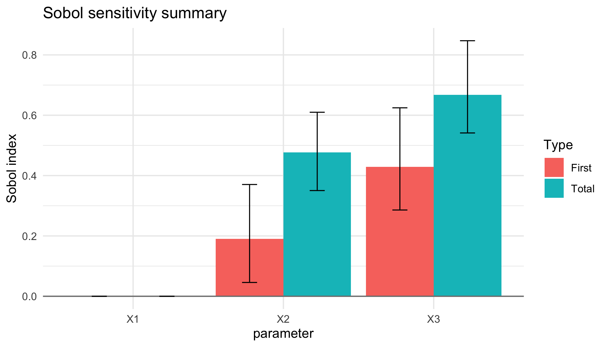
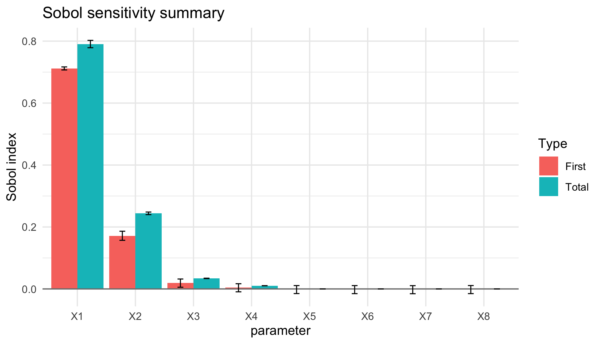

<!-- README.md is generated from README.Rmd. Please edit that file -->


# Sobol4R, Sobol Indices for Models with Fixed and Stochastic Parameters 

## Frédéric Bertrand, Elizaveta Logosha and Myriam Maumy-Bertrand

<!-- badges: start -->
[](https://github.com/fbertran/Sobol4R/actions/workflows/R-CMD-check.yaml)
[](https://github.com/fbertran/Sobol4R/actions/workflows/rhub.yaml)
<!-- badges: end -->

Tools to design experiments, compute Sobol sensitivity indices,
    and summarise stochastic responses inspired by the strategy described by
    Zhu et Sudret (2021) <https://doi.org/10.1016/j.ress.2021.107815>. Includes helpers
    to optimise toy models implemented in C++, visualise indices with
    uncertainty quantification, and derive reliability-oriented sensitivity
    measures based on failure probabilities.
    It is further detailed in Logosha, Maumy and Bertrand (2022) 
    <https://doi.org/10.1063/5.0246026> and (2023) <https://doi.org/10.1063/5.0246024> or in Bertrand, 
    Logosha and Maumy (2024) <https://hal.science/hal-05371803>, 
    <https://hal.science/hal-05371795> and <https://hal.science/hal-05371798>.
    
This site was created by F. Bertrand and the examples reproduced on it were created by F. Bertrand, E. Logosha and M. Maumy.

## Installation

You can install the latest version of the Sobol4R package from [github](https://github.com) with:


``` r
devtools::install_github("fbertran/Sobol4R")
```

## Two complementary analysis paths

Sobol4R exposes two ways to compute sensitivity indices depending on your
workflow:

* **Reuse the `sensitivity` package estimators.** Provide pre-built designs and
  call `sensitivity::sobol()` or `sensitivity::sobol2007()`; the `autoplot()`
  methods in Sobol4R will visualise those results without changing your
  existing code.
* **Use the in-package Saltelli re-implementation.** The `sobol_design()` and
  `sobol_indices()` helpers build the matrices, run the model, and return
  a `sobol_result` object that can be summarised or plotted directly, with
  optional bootstrap quantiles for noisy simulations.


## Two complementary analysis paths

Sobol4R exposes two ways to compute global sensitivity indices, depending on your
workflow and the level of control you require.

*	**Use the in-package estimators with built-in Jansen support.**
The streamlined `sobol_design()` and `sobol_indices()` helpers generate the
Saltelli-type matrices, evaluate the model (including replicated runs for
stochastic simulators), and return a unified `sobol_result` object.
Sobol4R implements several estimators internally, including Jansen, Martinez
and Saltelli.
**The default estimator is Jansen**, chosen for its numerical robustness and
stable behaviour with non centred or noisy outputs.
Results can be summarised or plotted directly and may include bootstrap
quantiles when analysing stochastic simulators.

*	**Reuse the estimators from the `sensitivity` package.** 
You can generate designs with Sobol4R (or your own routines) and pass the
matrices directly to `sensitivity::sobol()`, `sensitivity::sobol2007()`,
`sensitivity::soboljansen()`, `sensitivity::sobolEff()`, or
`sensitivity::sobolmartinez()`.
Sobol4R provides `autoplot()` methods that visualise these objects without
altering your existing code.

### Estimator defaults

The `sobol4r_design()`, `sobol4r_run()`, and `sobol4r_qoi_indices()` helpers
mirror the `sensitivity` estimators: `sobol`, `sobol2007`, `soboljansen`,
`sobolEff`, and `sobolmartinez`. They default to `soboljansen` because it is a
numerically robust choice for both deterministic and stochastic simulators. A
reasonable ordering for general-purpose work is:

1. `soboljansen` – stable first and total order indices, variance of
   differences, and broadly used in the literature.
2. `sobolEff` – efficient and well behaved, but a little more specialised than
   Jansen.
3. `sobolmartinez` – robust, though less common in practice.
4. `sobol` / `sobol2007` – retained for backward compatibility with the
   original Saltelli-style estimators; they are less suited as defaults unless
   you explicitly centre outputs and control the setup.
   
The README examples below demonstrate the second path, while the earlier
"Context and non random case" section illustrates interoperability with
`sensitivity`.

## Motivation

The methodology implemented in **Sobol4R** builds upon the stochastic Sobol
analysis described by Lebrun et al. (2021) in *Reliability Engineering &
System Safety*. The paper proposes to combine replicated simulator
runs with Sobol estimators to account for intrinsic noise. The package mirrors
this workflow:

1. Generate two Monte Carlo designs (A and B matrices).
2. Evaluate the stochastic simulator several times to estimate the mean
   response and the noise variance.
3. Derive first-order and total-order Sobol indices and visualise the results.

The package is also friendly with the `sensitivity` package and shows how to use the Sobol' indices estimators provided in this package to increase the capabilities of this `Sobol4R` package.

## Basic usage


``` r
library(Sobol4R)
set.seed(123)
design <- sobol_design(n = 256, d = 3, lower = rep(-pi, 3), upper = rep(pi, 3),
                       quasi = TRUE)
result <- sobol_indices(ishigami_model, design, replicates = 4,
                        keep_samples = TRUE)
result$data
#>   parameter first_order  total_order
#> 1        X1   0.4613292 4.263399e-05
#> 2        X2   0.8036762 3.506136e-01
#> 3        X3   0.6494604 1.963439e-01
```

The resulting object stores the Monte Carlo variance estimate, the average
noise variance across replications, and the Sobol indices. Diagnostic plots are
available through the provided `autoplot()` method:


``` r
autoplot(result)
```

<div class="figure">

<p class="caption">plot of chunk unnamed-chunk-3</p>
</div>

When `keep_samples = TRUE`, bootstrap resamples quantify the estimator
uncertainty. The helper `summarise_sobol()` produces tidy quantiles that can be
visualised directly:


``` r
autoplot(result, show_uncertainty = TRUE, probs = c(0.1, 0.9), bootstrap = 100)
```

<div class="figure">

<p class="caption">plot of chunk unnamed-chunk-4</p>
</div>

## Consistency check with the `sensitivity` estimators on Ishigami

The package exposes two ways to estimate Sobol indices: the in-package Saltelli
implementation (`sobol_indices()`) and the `sensitivity` package estimators
through `sobol4r_design()`. When comparing both, make sure the samples live on
the correct domain of the simulator. The Ishigami benchmark expects
\([-\pi, \pi]\) inputs; using the default \([0, 1]\) cube would distort the
indices and create spurious discrepancies.


``` r
library(Sobol4R)

set.seed(123)
design <- sobol_design(
  n     = 512,
  d     = 3,
  lower = rep(-pi, 3),
  upper = rep(pi, 3),
  quasi = TRUE
)

sobol4r_result <- sobol_indices(ishigami_model, design, replicates = 1)

sens_design <- sobol4r_design(
  X1 = as.data.frame(design$A),
  X2 = as.data.frame(design$B),
  order = 1,
  type = "sobol2007"
)
sens_output <- sensitivity::tell(sens_design, ishigami_model(as.matrix(sens_design$X)))

cbind(S_Sobol4R = sobol4r_result$data$first_order,
      T_Sobol4R = sobol4r_result$data$first_order, 
      S_sobol2007 = sens_output$S, 
      T_sobol2007 = sens_output$T) 
#>    S_Sobol4R T_Sobol4R     original      original
#> X1 0.2120769 0.2120769 0.0001129205 -6.480656e-05
#> X2 0.6454254 0.6454254 0.4415467860  4.338937e-01
#> X3 0.5724272 0.5724272 0.3770367118  3.499661e-01
```

Both estimators now report matching first-order and total-order indices for the
Ishigami function because they rely on the same \([-\pi, \pi]\) inputs.

## Reliability metrics

The paper highlights the need to quantify failure probabilities associated with
critical performance levels. The package exposes a helper for that task:


``` r
set.seed(321)
simulated <- ishigami_model(matrix(runif(3000, -pi, pi), ncol = 3))
estimate_failure_probability(simulated, threshold = -1)
#> $probability
#> [1] 0.087
#> 
#> $variance
#> [1] 7.9431e-05
```

When the simulator is stochastic and `sobol_indices()` stores the replicated
samples (`keep_samples = TRUE`), the same Monte Carlo budget can be recycled to
derive failure-indicator Sobol indices:


``` r
failure <- sobol_reliability(result, threshold = -1)
failure$failure_probability
#> [1] 0.08984375
autoplot(failure, show_uncertainty = TRUE, probs = c(0.1, 0.9), bootstrap = 200)
```

<div class="figure">

<p class="caption">plot of chunk unnamed-chunk-7</p>
</div>

## Combined usage with the `sensitivity` package

### Test case : the non-monotonic Sobol g-function

The method of Sobol requires two samples. In this reference case there are eight variables, all following the uniform distribution on $[0,1]$.


``` r
if(require(sensitivity)){
n <- 50000
p <- 8
X1_1 <- data.frame(matrix(runif(p * n), nrow = n))
X2_1 <- data.frame(matrix(runif(p * n), nrow = n))
}
```


``` r
if(require(sensitivity)){
set.seed(4669)
gensol1 <- sobol4r_design(
  X1    = X1_1,
  X2    = X2_1,
  order = 2,
  nboot = 100
)

Y1 <- sobol_g_function(gensol1$X)
x1 <- sensitivity::tell(gensol1, Y1)
print(x1)
}
#> 
#> Call:
#> sensitivity::soboljansen(model = NULL, X1 = X1, X2 = X2, nboot = nboot)
#> 
#> Model runs: 500000 
#> 
#> First order indices:
#>         original         bias  std. error
#> X1  7.158762e-01 0.0003292708 0.002812138
#> X2  1.788848e-01 0.0002168606 0.007105269
#> X3  2.477209e-02 0.0005654484 0.006774502
#> X4  6.589111e-03 0.0004831405 0.006838746
#> X5 -1.211742e-04 0.0005313759 0.006681976
#> X6  3.030053e-04 0.0005629356 0.006669775
#> X7  1.020259e-05 0.0005726937 0.006679191
#> X8  2.148300e-04 0.0005568268 0.006667389
#>       min. c.i.  max. c.i.
#> X1  0.710251368 0.72240556
#> X2  0.163947268 0.19201201
#> X3  0.009567471 0.03720730
#> X4 -0.008588815 0.01938342
#> X5 -0.015365761 0.01157217
#> X6 -0.015078821 0.01199152
#> X7 -0.015407550 0.01182783
#> X8 -0.015109380 0.01171543
#> 
#> Total indices:
#>        original          bias   std. error
#> X1 0.7935715807  7.383122e-05 5.720433e-03
#> X2 0.2415268270 -2.515680e-04 2.236182e-03
#> X3 0.0346698446  2.384117e-05 3.501189e-04
#> X4 0.0104714634  1.848957e-05 9.239132e-05
#> X5 0.0001052321 -2.571588e-08 9.742721e-07
#> X6 0.0001040942  1.012299e-07 1.107125e-06
#> X7 0.0001055571  8.766826e-08 8.914437e-07
#> X8 0.0001050610 -4.257143e-08 1.135505e-06
#>       min. c.i.    max. c.i.
#> X1 0.7816440833 0.8050569537
#> X2 0.2375455362 0.2463777104
#> X3 0.0340534615 0.0355355888
#> X4 0.0102682431 0.0106360252
#> X5 0.0001033743 0.0001069438
#> X6 0.0001021112 0.0001067899
#> X7 0.0001034028 0.0001068167
#> X8 0.0001028082 0.0001069985
```


``` r
if(require(sensitivity)){
autoplot(x1, ncol = 1)
}
```

<div class="figure">

<p class="caption">plot of chunk det-g-plot</p>
</div>


You can also use the `sobol_example_g_deterministic()` wrapper for this example.


``` r
if(require(sensitivity)){ex1_results <- sobol_example_g_deterministic()
print(ex1_results)
}
#> 
#> Call:
#> sensitivity::soboljansen(model = NULL, X1 = X1, X2 = X2, nboot = nboot)
#> 
#> Model runs: 500000 
#> 
#> First order indices:
#>        original          bias  std. error
#> X1  0.711999848  2.759449e-05 0.002631360
#> X2  0.171069444 -3.243317e-04 0.006964257
#> X3  0.019197160  2.380097e-04 0.006570602
#> X4  0.004399632  6.982094e-05 0.006591532
#> X5 -0.001721617  2.932782e-05 0.006368456
#> X6 -0.001881114  5.734953e-05 0.006392574
#> X7 -0.002045248  6.137792e-05 0.006369883
#> X8 -0.001850079  3.301663e-05 0.006399314
#>       min. c.i.  max. c.i.
#> X1  0.707005109 0.71676704
#> X2  0.156977789 0.18629660
#> X3  0.005519545 0.03206075
#> X4 -0.009336102 0.01681319
#> X5 -0.014976702 0.01081698
#> X6 -0.015225964 0.01075163
#> X7 -0.015444700 0.01055871
#> X8 -0.015159481 0.01093466
#> 
#> Total indices:
#>        original          bias   std. error
#> X1 0.7904857363  4.208462e-04 6.178943e-03
#> X2 0.2444730973  2.926195e-04 2.151611e-03
#> X3 0.0340828543  4.398558e-05 3.338495e-04
#> X4 0.0103959879 -3.029215e-06 8.915942e-05
#> X5 0.0001065903  1.171617e-07 9.079141e-07
#> X6 0.0001057113  1.810632e-07 9.735431e-07
#> X7 0.0001059162 -3.643364e-08 9.103740e-07
#> X8 0.0001042162  4.693930e-08 9.855479e-07
#>       min. c.i.    max. c.i.
#> X1 0.7787869014 0.8025046920
#> X2 0.2399293818 0.2482734385
#> X3 0.0334363304 0.0347126444
#> X4 0.0102354937 0.0105765331
#> X5 0.0001045168 0.0001082466
#> X6 0.0001037793 0.0001075022
#> X7 0.0001040602 0.0001081730
#> X8 0.0001021336 0.0001062003
```


``` r
if(require(sensitivity)){
autoplot(ex1_results, ncol = 1)
}
```

<div class="figure">

<p class="caption">plot of chunk unnamed-chunk-10</p>
</div>


### Vignettes

There are more insights and examples in the vignettes.


``` r
vignette("Sobol_RV_five_examples", package = "Sobol4R")
vignette("Sobol4R_vignette_stochastic", package = "Sobol4R")
vignette("Sobol4R_vignette_process", package = "Sobol4R")
vignette("simmer_MM1_Sobol_example", package = "Sobol4R")
```


